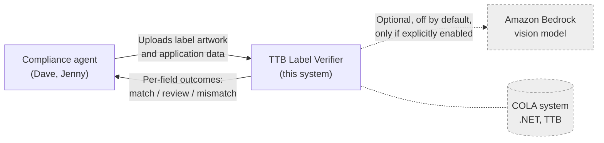
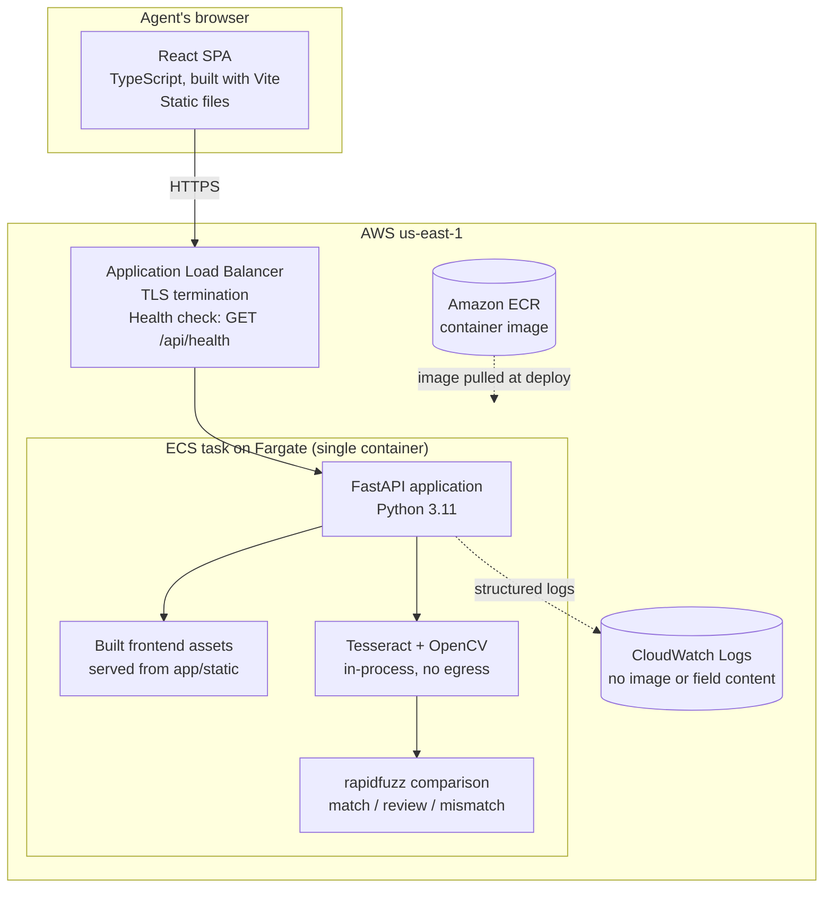
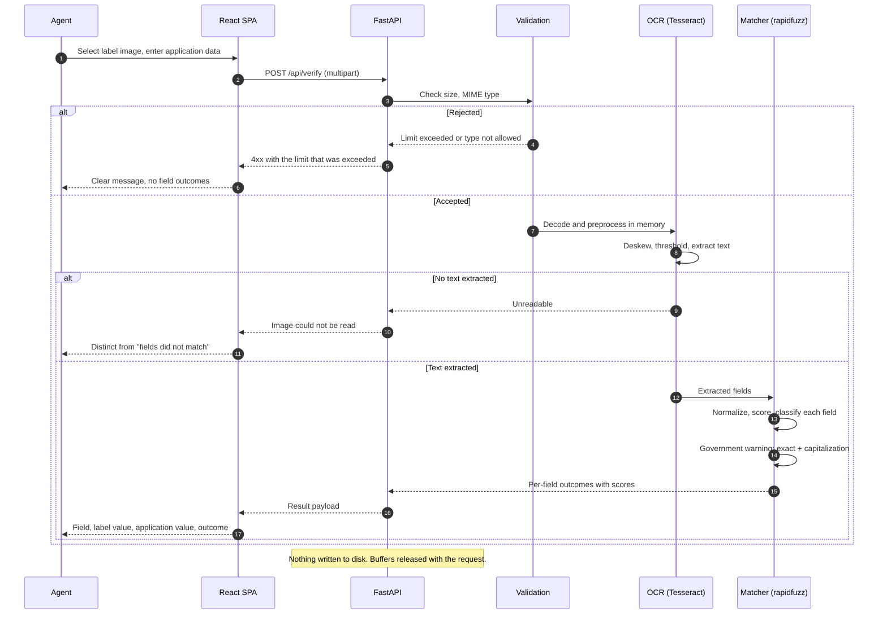
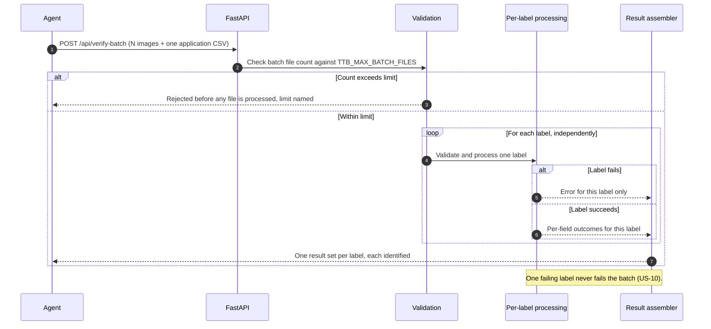

# Architecture

This document describes structure and flow. The reasoning behind each major
choice, with alternatives and consequences, is in the ADRs under
[adr/](adr/) and is not repeated here.

| ADR | Decision |
| --- | --- |
| [0001](adr/0001-cloud-platform-aws.md) | AWS commercial `us-east-1`, portable to a FedRAMP-authorized government region |
| [0002](adr/0002-compute-ecs-fargate-not-app-runner.md) | ECS with Fargate behind an ALB, not App Runner |
| [0003](adr/0003-local-ocr-default-bedrock-optional.md) | Local OCR by default, optional Bedrock fallback |
| [0004](adr/0004-fuzzy-matching-with-review-band.md) | Normalized fuzzy matching with a human-review band |
| [0005](adr/0005-git-flow-branching.md) | Git Flow branching |

## 1. System context



Dashed elements are not part of the default running system. COLA is shown only
to mark it as explicitly out of scope: "we're not looking to integrate with COLA
directly." [Source: Marcus Williams interview]

The agent supplies the application data directly. Because there is no COLA
integration, nothing retrieves it automatically.

## 2. Container view



The frontend and backend ship in **one** container image. The build compiles the
React application to static files, and the FastAPI process serves them. This
keeps the prototype to a single deployable unit and removes the need for a
separate origin, bucket, or CDN.

## 3. Request flow: single label verification



The failure branches are drawn explicitly because they are a graded criterion:
"User experience and error handling." [Source: Evaluation Criteria] The
distinction between "could not read the image" and "fields did not match"
matters to the agent, who takes a different action in each case.
[Source: Jenny Park interview]

## 4. Request flow: batch verification



Isolation between labels is the design property that matters here. Sarah's
scenario is a 300-application drop; losing 299 good results to one bad image
would make the tool useless in exactly the case it was built for.
[Source: Sarah Chen interview]

Batch concurrency, and whether long batches need an asynchronous job model
rather than a single request, are unresolved; see OQ-6 in
[OPEN_QUESTIONS.md](OPEN_QUESTIONS.md).

## 5. Component responsibilities

### 5.1 Module map

The single-label path is implemented in `backend/app/`. Each module names the
requirement it exists to satisfy in its own docstring, so a reader arriving at a
file does not have to come back here to find out why it exists.

| Module | Responsibility | Governing requirements | Tests |
| --- | --- | --- | --- |
| `config.py` | Every tunable value, read once from the environment at startup | NFR-11, NFR-3, NFR-7 | `tests/test_compare.py` reads the thresholds it asserts against |
| `ocr.py` | Decode, preprocess (long edge to 1600 px, grayscale, adaptive threshold, bounded deskew), run Tesseract, return text with word confidence, line geometry and elapsed time | FR-1, NFR-1, NFR-3, NFR-6 | `tests/test_ocr.py` |
| `warning.py` | The 27 CFR 16.21 statement as a constant, exact body comparison after whitespace normalization, and a separate capitalization check on the prefix | FR-5, FR-6, OOS-4 | `tests/test_warning.py` |
| `parse.py` | Locate the five fields in the OCR output, with an explicit not found per field | FR-1, A-9 | `tests/test_parse.py` |
| `compare.py` | Normalization, `rapidfuzz` scoring, the three outcomes, the A-12 alcohol content rules and the A-13 net contents rules | FR-3, FR-4, FR-7, A-4, A-12, A-13 | `tests/test_compare.py` |
| `schemas.py` | The response contract, including `external_call_made` and the warning detail block | FR-2, FR-3, FR-6, NFR-1, NFR-3 | asserted through `tests/test_api_validation.py` and `tests/test_verify_integration.py` |
| `verify.py` | The single-image pipeline both routes run: the MIME and size checks, OCR, parse, compare, and the assembled result | FR-1, FR-2, FR-3, FR-9, NFR-1 | `tests/test_verify_integration.py`, `tests/test_batch.py` |
| `batch.py` | The A-14 CSV parser, reconciliation of images against rows, the bounded worker pool, and the NDJSON writer | FR-8, FR-9, NFR-2, NFR-6 | `tests/test_batch.py` |
| `api.py` | `POST /api/verify` and `POST /api/verify-batch`, the upload-size middleware, and the FR-9 error shapes | FR-1, FR-2, FR-8, FR-9, NFR-6, NFR-7 | `tests/test_api_validation.py`, `tests/test_verify_integration.py`, `tests/test_batch.py` |

Two implementation notes that are not obvious from the table:

- **The size check is middleware, not a route dependency.** NFR-7 requires the
  size to be checked "before the body is read into memory". FastAPI parses the
  multipart body while resolving the endpoint's parameters, so by the time any
  handler or dependency code runs the body has already been read. Middleware
  runs before routing, and returning from it without calling the next handler
  means the body is never consumed.
- **Starlette's multipart spool threshold is raised to the upload limit.** Its
  default rolls any part over 1 MB onto a temporary file on disk, which NFR-6
  forbids. Raising the threshold keeps every accepted upload in memory. Note
  that the parser's neighbouring `max_part_size` is not what bounds an image:
  it applies to non-file parts only, and a file part streams into the spooled
  file with no cap of its own. Images are bounded exactly, after parsing, by
  `verify.check_size`.
- **`OMP_THREAD_LIMIT` is pinned to 1 by `ocr.py`.** Tesseract is built against
  OpenMP, and its OpenMP runtime deadlocks when the binary is invoked from a
  thread other than the process main thread. `POST /api/verify` never met this
  because an async handler runs OCR on the event loop thread; the batch worker
  pool does not. Without the pin a batch hangs rather than failing. One thread
  per invocation is also the right shape, because the pool already parallelizes
  across images. See ADR 0006.
- **The batch response is a stream, so its status line is sent before any row
  is computed.** There is no way to turn a later failure into an HTTP error, so
  `batch.py` converts every per-row exception into that row's error line. This
  is what FR-8 and NFR-2 require anyway: one unreadable image must not fail the
  batch.

**Brand name and class or type are located by type size, and that is a
heuristic.** Alcohol content, net contents and the warning carry patterns to
match. The other two do not, and no source states a layout rule for them, so
`parse.py` ranks the remaining text by the glyph height Tesseract reports and
takes the largest as the brand name. Adjacent lines of similar size are grouped
first, so a brand name set across two lines stays one brand name. Where the
heuristic fails, the field reports not found rather than a guess (FR-1). How
often it fails is measured by `scripts/measure.py` rather than asserted here.

### 5.2 Responsibilities and non-responsibilities

| Component | Responsibility | Explicitly not responsible for |
| --- | --- | --- |
| React SPA | Collect the image and application data; present per-field outcomes accessibly; show batch progress | Any comparison logic; any judgment about compliance |
| FastAPI routing layer | HTTP contract, request lifecycle, error shaping | Image decoding; matching |
| Validation | Size, MIME type, and batch count limits, enforced before decoding | Content correctness |
| Extraction (Tesseract, OpenCV) | Turn image pixels into text for the five fields | Deciding whether a value is correct |
| Matcher (rapidfuzz) | Normalize, score, and classify each field into match, review, or mismatch | Extraction; presentation |
| Warning checker | Exact body comparison against 27 CFR 16.21 plus a separate capitalization check on the prefix | Bold type, font size, contrast, placement (OOS-4, OOS-5) |
| Result assembler | Per-field and per-label result payloads carrying values and scores | Persistence of any kind |

The boundary that matters most: **the tool recommends, the agent decides.**
Nothing in this system issues an approval or rejection. That is a design
position, not an omission; see [06_SECURITY_AND_COMPLIANCE.md](06_SECURITY_AND_COMPLIANCE.md).

## 6. Data handling

**Nothing is persisted.** [Source: Decision D-9; Marcus Williams interview]

| Data | Where it lives | Lifetime |
| --- | --- | --- |
| Uploaded label image | Process memory only | Released when the request completes |
| Application data | Process memory only | Released when the request completes |
| Extracted text | Process memory only | Released when the request completes |
| Results | Returned in the HTTP response | Not retained server side |
| Logs | CloudWatch Logs | Retention set at deployment. Contain no image content and no extracted field values. |

Consequences, stated plainly rather than left implicit:

- There is no audit record that a verification happened. A production system in
  a regulatory workflow would need one.
- There is no way to reprocess a submission after the fact.
- No authentication means no attribution of an action to a person.

The production path for each is in
[06_SECURITY_AND_COMPLIANCE.md](06_SECURITY_AND_COMPLIANCE.md).

## 7. Configuration

All configuration arrives through environment variables, read once at startup by
`backend/app/config.py`. No credential or environment-specific value is
committed. [Source: Decision D-4; Decision D-9]

| Variable | Default | Purpose |
| --- | --- | --- |
| `TTB_ENVIRONMENT` | `local` | Environment name reported by the health endpoint |
| `TTB_LOG_LEVEL` | `INFO` | Log verbosity |
| `TTB_ENABLE_BEDROCK_FALLBACK` | `false` | Enables the optional vision-model fallback. Off by default so the default path makes no outbound calls. |
| `TTB_BEDROCK_REGION` | `us-east-1` | Region for the fallback, when enabled |
| `TTB_BEDROCK_MODEL_ID` | empty | Model identifier for the fallback, when enabled |
| `TTB_MAX_UPLOAD_BYTES` | `10485760` | Per-file size limit, enforced before the body is read |
| `TTB_MAX_BATCH_FILES` | `300` | Batch file-count limit, enforced before processing |
| `TTB_BATCH_WORKERS` | `0` | How many images a batch reads at once. `0` derives it from the cores the process may use, because OCR is CPU bound and runs in-process. |
| `TTB_MAX_BATCH_BYTES` | `0` | Largest batch request body accepted, checked from Content-Length before the body is read. `0` derives it as `TTB_MAX_BATCH_FILES * TTB_MAX_UPLOAD_BYTES`, about 3 GiB at the defaults. See the note below. |
| `TTB_ALLOWED_MIME_TYPES` | `image/jpeg`, `image/png`, `image/webp`, `image/tiff` | Accepted upload types, checked before decoding. Set as a JSON array. |
| `TTB_OCR_LONG_EDGE_PX` | `1600` | The long edge an image is scaled to before OCR |
| `TTB_MATCH_THRESHOLD` | `95` | At or above this score, a field is a match |
| `TTB_REVIEW_THRESHOLD` | `80` | Between this and the match threshold, a field needs human review |
| `TTB_ABV_TOLERANCE` | `0.0` | Allowed difference, in percentage points, between the label ABV and the application ABV. Zero means the two declared values must be identical (A-12). |

The two threshold defaults are starting points chosen to be tuned against the
labeled sample set, not values derived from any source. They are marked as
assumptions; see [ASSUMPTIONS.md](ASSUMPTIONS.md) and OQ-9.

`TTB_ABV_TOLERANCE` is different: `0.0` is a deliberate compliance position, not
a starting point for tuning. The regulatory tolerances in 27 CFR 5.65, 4.36, and
7.65 govern actual against labeled alcohol content, and this tool compares two
declared values, so no tolerance applies. The variable exists so the position can
change without a code change if a compliance agent states otherwise. See A-12 in
[ASSUMPTIONS.md](ASSUMPTIONS.md).

`TTB_MAX_BATCH_BYTES` needs reading before a task is sized. FastAPI parses the
whole multipart envelope while resolving the route's parameters, so a batch is
in memory before any of it is processed. The derived default is the largest
batch the two stated limits already permit rather than a figure invented here,
which makes it an upper bound and not a memory guarantee. Setting a real ceiling
here, or lowering `TTB_MAX_BATCH_FILES`, is the lever for bounding batch memory.
Recorded against OQ-13 item 6.

In deployed environments these are supplied by the ECS task definition. Secrets,
if any are ever introduced, come from AWS Secrets Manager by reference and never
from a committed file. Today the application requires no secret to run its
default path.

## 8. Runtime environment and tool versions

| Component | Version | How verified |
| --- | --- | --- |
| Python | 3.11 | `python:3.11-slim-bookworm` base image; local `python3 --version` reported 3.11.15 |
| Node.js | 22 | `node:22-bookworm-slim` build image; local `node --version` reported v22.22.2 |
| Docker | 29.3.1 | `docker --version` in the build session |
| Tesseract | 5.3.0 | `tesseract --version` against the built image, in CI run 32574942848 |
| Leptonica | 1.82.0 | Reported by the same `tesseract --version` output |

**Tesseract version, verified.** The `container build and SBOM` CI job runs
`tesseract --version` inside the built image and publishes the result to the
workflow run summary. Read from the most recent successful CI run on `develop`,
run 32574942848 at commit `ef3086a`, step "Report the Tesseract version in the
image":

```
tesseract 5.3.0
 leptonica-1.82.0
  libgif 5.2.1 : libjpeg 6b (libjpeg-turbo 2.1.2) : libpng 1.6.39 :
  libtiff 4.5.0 : zlib 1.2.13 : libwebp 1.2.4 : libopenjp2 2.5.0
```

Run URL:
<https://github.com/kimkight/26-DO-12891471-DH_T_ITS_AI_THT/actions/runs/32574942848>

That is the version Debian bookworm ships, which is what the Dockerfile installs
from: `tesseract-ocr` and `tesseract-ocr-eng` are pulled from the bookworm
repositories at image build time. The version therefore moves only when the
`python:3.11-slim-bookworm` base image moves to a different Debian release, and
a base image change should be treated as a change to this row. The version also
appears in the SBOM artifact attached to every CI run, which is the durable
record.

**5.3.0 is the LSTM-era Tesseract**, so the OCR path in section 4 uses the
neural engine rather than the legacy pattern matcher. No claim is made here
about its accuracy on label artwork; that is OQ-8, and it is unmeasured.

Only English language data is installed, per the build instruction not to add
OCR models beyond English.

## 9. Portability to a FedRAMP-authorized government region

**Decision D-11: Target environment.** The agency states it is on Azure
(Marcus Williams interview). This prototype deploys to AWS commercial
`us-east-1` by the author's choice, for delivery speed on the platform the
author knows best, which the assignment permits. The architecture is
container-first and cloud-portable by design; a production deployment would
target the agency's platform, presumed to be Azure Government, and that would be
a deployment change rather than a redesign. FedRAMP status of any target service
is confirmed against the FedRAMP Marketplace at deployment time, not asserted
here. [Source: Decision D-1; Decision D-11;
[cloud_choice_and_abv_assumption.md](cloud_choice_and_abv_assumption.md)
section 1]

The architecture holds both paths open by construction:

- **Partition independence.** AWS GovCloud (US) uses the `aws-us-gov` ARN
  partition. No ARN, region, or account identifier is hardcoded; they are
  derived from Terraform data sources (NFR-10).
- **Service selection.** The runtime uses ECR, ECS on Fargate, an Application
  Load Balancer, IAM, and CloudWatch Logs. App Runner was excluded partly for
  this reason; see [ADR 0002](adr/0002-compute-ecs-fargate-not-app-runner.md).
- **No egress dependency.** The default path makes no outbound calls, so the
  system does not assume reachability of any external endpoint. This matters in
  a restricted network, which is the environment Marcus describes.
  [Source: Marcus Williams interview]
- **The optional Bedrock fallback is the one portability risk.** Model
  availability differs between commercial regions and government regions, and
  Bedrock has no equivalent on Azure. Because the fallback is off by default and
  is not on the committed path, it cannot block a deployment to either target.
  Availability must be confirmed before it is relied on anywhere.
- **A move to Azure is a deployment change, not a redesign.** ECS on Fargate
  maps to Azure Container Apps or AKS running the same image. The infrastructure
  code is the part that does not transfer: Terraform would need an Azure
  provider module before a pilot. See
  [ADR 0001](adr/0001-cloud-platform-aws.md).

Service availability and FedRAMP in-scope status, in AWS GovCloud (US) or in
Azure Government, are **not asserted here**. They must be confirmed against the
FedRAMP Marketplace and the provider's documentation at deployment time; see
[06_SECURITY_AND_COMPLIANCE.md](06_SECURITY_AND_COMPLIANCE.md).

## 10. Current implementation status

| Endpoint | State |
| --- | --- |
| `GET /api/health` | Implemented |
| `POST /api/verify` | Implemented. Extraction, comparison and the warning checks all run; see the module map in section 5.1. |
| `POST /api/verify-batch` | Implemented, per [ADR 0006](adr/0006-batch-execution-model.md). One synchronous multipart request, a bounded worker pool, results streamed as newline-delimited JSON, no job store. FR-8, NFR-2, US-9 through US-11. |

Nothing is deployed. Accuracy and latency are measured on synthetic labels by
`scripts/measure.py` and on a session runner, not on the deployed target; see
the Status section of the [README](../README.md).
