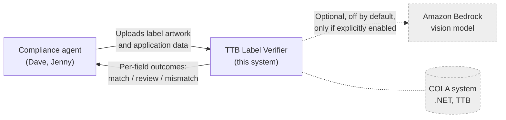
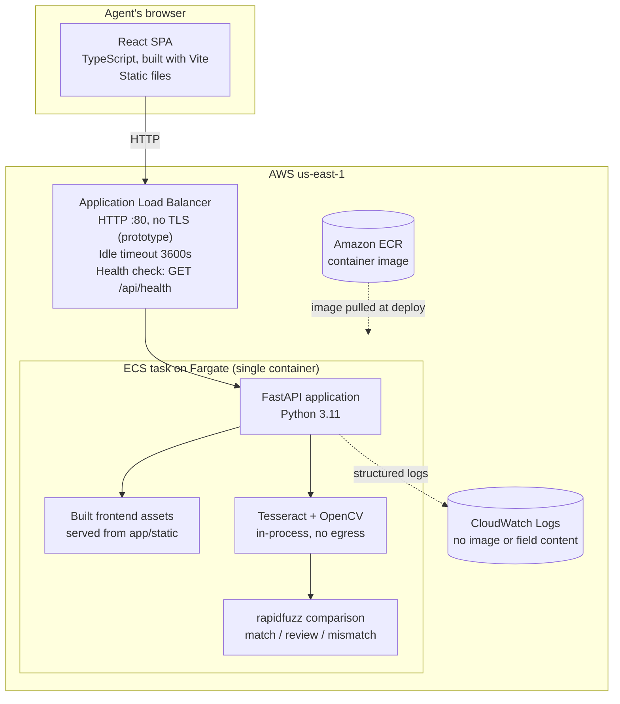
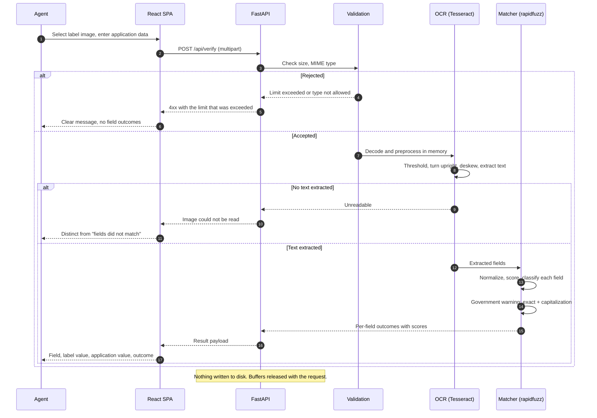
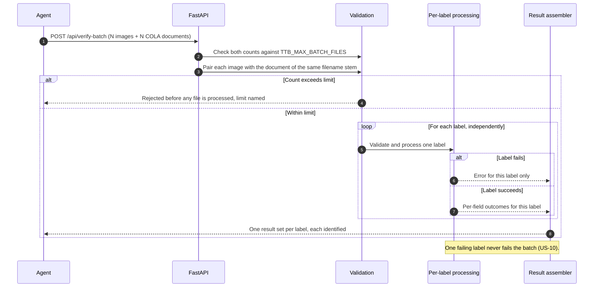

# Architecture

This document describes structure and flow. The reasoning behind each major
choice, with alternatives and consequences, is in the ADRs under
[adr/](adr/) and is not repeated here.

| ADR | Decision |
| --- | --- |
| [0001](adr/0001-cloud-platform-aws.md) | AWS commercial `us-east-1`, portable to a FedRAMP-authorized government region |
| [0002](adr/0002-compute-ecs-fargate-not-app-runner.md) | ECS with Fargate behind an ALB, not App Runner |
| [0003](adr/0003-local-ocr-default-bedrock-optional.md) | Local OCR by default, optional Bedrock fallback |
| [0004](adr/0004-fuzzy-matching-with-review-band.md) | Normalized fuzzy matching with a human-review band |
| [0005](adr/0005-git-flow-branching.md) | Git Flow branching |

## 1. System context



Dashed elements are not part of the default running system. COLA is shown only
to mark it as explicitly out of scope: "we're not looking to integrate with COLA
directly." [Source: Marcus Williams interview]

The agent supplies the application data directly. Because there is no COLA
integration, nothing retrieves it automatically.

## 2. Container view



The frontend and backend ship in **one** container image. The build compiles the
React application to static files, and the FastAPI process serves them. This
keeps the prototype to a single deployable unit and removes the need for a
separate origin, bucket, or CDN.

It also means the interface is same-origin with the API, so there is no CORS
configuration and no second hostname to get right at deployment time. The
frontend calls `/api/verify` and `/api/verify-batch` with a relative path and
nothing else.

## 3. Request flow: single label verification



The failure branches are drawn explicitly because they are a graded criterion:
"User experience and error handling." [Source: Evaluation Criteria] The
distinction between "could not read the image" and "fields did not match"
matters to the agent, who takes a different action in each case.
[Source: Jenny Park interview]

## 4. Request flow: batch verification



**What a batch is made of** ([ADR 0009](adr/0009-batch-cola-documents.md)).
Label images plus one COLA document for each, in one multipart request as
repeated `images` and `application_documents` parts, **paired by filename
stem**: `0001-stones-throw.png` pairs with `0001-stones-throw.pdf`. The stem is
the filename with its final extension removed, compared without regard to case,
and only the final extension is removed. Each document is read by the FR-11
parser inside the worker pool, per row, so the reading is parallelized and a
document that cannot be read is that row's error rather than the batch's.

This replaced a CSV of application data keyed by image filename, assumed as
A-14. Nothing an importer files with TTB produces such a file; what they file is
a COLA form plus label images, which FR-11 can read. A-14 is marked superseded
rather than deleted.

Every value on this path is parsed rather than typed, so each row's result
carries the same parsed block and the same per-field source marks a single-label
submission with an attached document carries.

Pairing failures are per row, not per batch. An image with no document, a
document with no image, two documents on one stem and two images on one stem
each report an error on their own line; only a submission with no images at all,
or no documents at all, is refused as a whole.

Isolation between labels is the design property that matters here. Sarah's
scenario is a 300-application drop; losing 299 good results to one bad image
would make the tool useless in exactly the case it was built for.
[Source: Sarah Chen interview]

**PDFium is serialized.** It is not thread-safe, and this pool reads documents
concurrently: two at once segfaults the process and takes the stream with it.
Every call into PDFium is made under one lock in `application_form.py`, with the
OCR fallback outside it so a batch of scanned documents still spends its
expensive step in parallel.

Batch concurrency, and whether long batches need an asynchronous job model
rather than a single request, are unresolved; see OQ-6 in
[OPEN_QUESTIONS.md](OPEN_QUESTIONS.md).

## 5. Component responsibilities

### 5.1 Module map

The verification engine is implemented in `backend/app/` and the interface in
`frontend/src/`. Each module names the requirement it exists to satisfy in its
own docstring, so a reader arriving at a file does not have to come back here to
find out why it exists.

| Module | Responsibility | Governing requirements | Tests |
| --- | --- | --- | --- |
| `config.py` | Every tunable value, read once from the environment at startup | NFR-11, NFR-3, NFR-7 | `tests/test_compare.py` reads the thresholds it asserts against |
| `verify.py` | The pipeline both routes run: read every submitted photograph of one label, merge the fields across them per ADR 0007, and assemble the response | FR-1, FR-2, FR-3, FR-9 | `tests/test_verify_integration.py`, `tests/test_multi_photo.py` |
| `ocr.py` | Decode honouring the EXIF orientation tag, preprocess (long edge to 1600 px, grayscale, cardinal turn from Tesseract OSD asked on the grayscale, adaptive threshold, then bounded deskew), read both the thresholded image and the plain upright grayscale and keep the higher-scoring result, return text with word confidence, line geometry, the orientation applied, which read won and elapsed time | FR-1, NFR-1, NFR-3, NFR-6 | `tests/test_ocr.py` |
| `warning.py` | The 27 CFR 16.21 statement as a constant, exact body comparison after whitespace normalization, and a separate capitalization check on the prefix | FR-5, FR-6, OOS-4 | `tests/test_warning.py` |
| `parse.py` | Locate the five fields in the OCR output, with an explicit not found per field | FR-1, A-9 | `tests/test_parse.py` |
| `application_form.py` | Read the application values off an uploaded COLA document: AcroForm field values, then the text layer, then OCR over rendered pages, then the label artwork embedded in the file, which fills what the text left empty and can stand in as the label side. An explicit not found per value, with the reason where the form has no item for it. Serializes every PDFium call, because the batch pool reads documents concurrently and PDFium is not thread-safe | FR-11, FR-9, FR-8, NFR-3, NFR-6, A-17, ADR 0010 | `tests/test_application_form.py`, `tests/test_cola_document_api.py`, `tests/test_embedded_artwork.py`, `tests/test_batch.py` |
| `compare.py` | Normalization, `rapidfuzz` scoring, the three outcomes, the A-12 alcohol content rules and the A-13 net contents rules | FR-3, FR-4, FR-7, A-4, A-12, A-13 | `tests/test_compare.py` |
| `schemas.py` | The response contract, including `external_call_made` and the warning detail block | FR-2, FR-3, FR-6, NFR-1, NFR-3 | asserted through `tests/test_api_validation.py` and `tests/test_verify_integration.py` |
| `verify.py` | The single-image pipeline both routes run: the MIME and size checks, OCR, parse, compare, and the assembled result | FR-1, FR-2, FR-3, FR-9, NFR-1 | `tests/test_verify_integration.py`, `tests/test_batch.py` |
| `batch.py` | The filename-stem pairing of images with COLA documents, the per-row pairing errors, the bounded worker pool, and the NDJSON writer | FR-8, FR-9, FR-11, NFR-2, NFR-6 | `tests/test_batch.py` |
| `api.py` | `POST /api/verify`, `POST /api/verify-batch` and `POST /api/read-application`, the upload-size middleware, and the FR-9 error shapes | FR-1, FR-2, FR-8, FR-9, FR-11, NFR-6, NFR-7 | `tests/test_api_validation.py`, `tests/test_verify_integration.py`, `tests/test_batch.py`, `tests/test_cola_document_api.py` |

Two implementation notes that are not obvious from the table:

- **The size check is middleware, not a route dependency.** NFR-7 requires the
  size to be checked "before the body is read into memory". FastAPI parses the
  multipart body while resolving the endpoint's parameters, so by the time any
  handler or dependency code runs the body has already been read. Middleware
  runs before routing, and returning from it without calling the next handler
  means the body is never consumed.
- **Starlette's multipart spool threshold is raised to the upload limit.** Its
  default rolls any part over 1 MB onto a temporary file on disk, which NFR-6
  forbids. Raising the threshold keeps every accepted upload in memory. Note
  that the parser's neighbouring `max_part_size` is not what bounds an image:
  it applies to non-file parts only, and a file part streams into the spooled
  file with no cap of its own. Images are bounded exactly, after parsing, by
  `verify.check_size`.
- **`OMP_THREAD_LIMIT` is pinned to 1 by `ocr.py`.** Tesseract is built against
  OpenMP, and its OpenMP runtime deadlocks when the binary is invoked from a
  thread other than the process main thread. `POST /api/verify` never met this
  because an async handler runs OCR on the event loop thread; the batch worker
  pool does not. Without the pin a batch hangs rather than failing. One thread
  per invocation is also the right shape, because the pool already parallelizes
  across images. See ADR 0006.
- **The batch response is a stream, so its status line is sent before any row
  is computed.** There is no way to turn a later failure into an HTTP error, so
  `batch.py` converts every per-row exception into that row's error line. This
  is what FR-8 and NFR-2 require anyway: one unreadable image must not fail the
  batch.

**An uploaded COLA document is read four ways, in order, and the order is the
point.** FR-11 accepts the applicant's label application as an alternative to
typing the same values, and the document reaches an agent in one of these
shapes:

1. **Form fields.** An applicant's filled-in copy of the downloadable
   TTB F 5100.31 keeps its values in AcroForm fields. They are not in the page's
   text layer at all, so reading the page finds the blank template's captions
   and nothing else. This is also the only place a ticked checkbox can be read,
   which is what makes item 5, the product type, legible.
2. **Embedded text.** COLAs Online output and a Public COLA Registry printout
   are digitally generated, so the characters are in the file. Extraction is
   deterministic: no recognition step, no confidence figure, no misread.
   `application_form.py` reads it through `pypdfium2` and hands the lines to the
   same caption reader the OCR path uses.
3. **OCR.** A scan or a photograph of a printed form carries pixels only. Its
   pages are rendered to bitmaps and read through exactly the `ocr.py` pipeline
   label artwork goes through, so it inherits that pipeline's accuracy and its
   failure modes. Orientation correction is off for a rendered PDF page, which
   is already upright, and on for an uploaded image, which may not be.
4. **Embedded label artwork.** The applicant affixes the label artwork to the
   application, so a filed PDF carries pictures of the labels alongside the
   typed items. Every embedded raster image at or above a size floor is lifted
   out of the file at its own resolution and read through the same `ocr.py`
   pipeline, with the same orientation and preprocessing decisions
   ([ADR 0010](adr/0010-embedded-label-artwork.md)). Extracted rather than
   rendered: a page render is capped at `TTB_OCR_LONG_EDGE_PX` across the whole
   page, so it throws away resolution the picture already has, and it hands the
   engine the form's own printed captions mixed in with the label text.

The first two run on every PDF. OCR runs only when neither produced a single
mapped value, because rendering and reading pages costs about what reading a
label photograph costs. `TTB_MAX_DOCUMENT_PAGES` bounds it, defaulting to 3,
which is one more page than either document needs and is a latency limit as much
as a parsing one. The artwork read runs on every PDF too, and is bounded
separately by `TTB_MAX_ARTWORK_IMAGES`, because a picture can sit on a page this
parser does not read for text: the author's own filing states its brand name on
page 1 and carries the label artwork on page 3.

**The three-source precedence, and where each part of it lives.**

| Rank | Source | Decided in | Reported as |
| --- | --- | --- | --- |
| 1 | Typed by the agent | `verify.resolve_application` | `typed` |
| 2 | The document's text layer or AcroForm fields | `application_form._combine` | `parsed_from_form` |
| 3 | Label artwork embedded in that document | `application_form._merge_artwork` | `parsed_from_artwork` |
| 4 | Nothing supplied it | `verify.resolve_application` | `absent` |

Two ranks are decided inside the document parser and two at the comparison
layer, which is deliberate: artwork against text is a question about one file
and is answered where the file is read, and typed against parsed is a question
about the agent and is answered where the agent's input arrives. Artwork never
overrides text, because a value the file states is read and a value off a
picture is recognized by an OCR engine. The response carries the winner per
field, so an agent can see which kind of evidence they are looking at.

**Where the label side comes from.** Normally from the photographs the agent
uploaded. When they uploaded none and their application document carried
readable artwork, the largest such image is the label side, and the response
says so in `label_source`, per image in `photos[].origin`, and in
`self_consistency_note`. That last one carries the limitation into the response
rather than leaving it in this document: checking artwork taken out of an
application against that same application shows that the filed artwork carries
the mandatory elements and agrees with the form, and shows nothing about a
physical bottle.

**Three of the five compared values are not on the form.** That is a property of
TTB F 5100.31 (04/2023), not of the parser: the class or type designation and
the alcohol content are not numbered items, and the net contents is item 15 only
when it is blown, branded or embossed on the container and does not appear on
the affixed labels. The parser reports each as not found **with the reason**, so
an agent is not sent looking for a box that does not exist. The full map is
assumption A-17; the decision is
[ADR 0008](adr/0008-cola-form-as-application-input.md).

**`POST /api/read-application` exists for the interface, not for the API.** The
parsed values have to reach an agent as editable fields before a verification
runs, so the agent confirms or corrects them and the check runs on what they
confirmed. Routing that through `POST /api/verify` would mean submitting the
label photographs and running OCR over them once to read the form and again to
run the check the agent then asked for. `POST /api/verify` still accepts an
`application_document` part for a caller that wants one request, and applies the
same precedence rule: a typed value overrides a parsed one, field by field.

**Brand name and class or type are located by type size, and that is a
heuristic.** Alcohol content, net contents and the warning carry patterns to
match. The other two do not, and no source states a layout rule for them, so
`parse.py` ranks the remaining text by the glyph height Tesseract reports and
takes the largest as the brand name. Adjacent lines of similar size are grouped
first, so a brand name set across two lines stays one brand name. Where the
heuristic fails, the field reports not found rather than a guess (FR-1). How
often it fails is measured by `scripts/measure.py` rather than asserted here.

#### Frontend modules

Plain React with no state manager, no component library, no CSS framework and no
runtime dependency beyond `react` and `react-dom`. Two endpoints and one screen
do not need more, and every layer added between an agent and a form is a layer
NFR-4 has to survive.

**The visual design, and the line it does not cross.** The palette is the
government one: navy (`#112e51` for the masthead band, `#1a4480` for working
primary) and a gold accent (`#c05600` for brackets and edges, `#9a4a08` where
gold has to carry text, `#ffbe2e` on navy only). The tool is about federal label
compliance, and a prototype with a brand of its own would be answering the wrong
question about whether it belongs in this workflow.

The surface around that palette is a soft, modern product surface rather than a
published form: white cards with 16px radii and layered low-opacity shadows over
a muted blue-grey field, a segmented pill control instead of underlined tabs,
soft-tinted inputs, pill buttons, small-caps kicker labels over card titles, and
Inter. That changed on 2026-08-28, on the author's review of the deployed page:
the tool is a working instrument and should read as one. **The palette did not
change with it**, and neither did anything the next paragraph lists.

Reflecting a design language and impersonating an agency are different things,
and the difference is enforced in tests rather than left to judgement:

- A banner is the first element on every view, before the masthead: "Prototype
  built for an employment assessment. Not an official TTB or Treasury system.
  Nothing you upload is stored." It is never dismissible.
- The footer names the author and the assignment.
- There is no TTB seal, no Treasury seal, no eagle, no coat of arms, and no
  "official website of the United States government" banner anywhere in the
  repository. No raster or vector asset is imported at all; every SVG is drawn
  inline and is geometric: the four outcome glyphs, and the kicker and tile
  icons the restyle added. None of them is a mark, and the masthead and the
  footer carry no image or SVG at all, which `branding.test.tsx` asserts.
- The agency's full name appears once, as plain text above the product name, at
  the size and weight a subject line gets rather than a wordmark's.

`src/__tests__/branding.test.tsx` asserts both halves: that the disclosures are
present in the words they were written in and in the positions that make them
read first, and that none of the forbidden marks or phrases appears in any
source file the built page is assembled from. It strips comments before
scanning, so the comment explaining which marks are forbidden is not itself a
violation.

**Inter is bundled, not fetched.** A clean geometric sans, published under the
SIL Open Font License 1.1, so using it is a licensing question with a clear
answer. It replaced Public Sans in the 2026-08-28 restyle: Public Sans is the
U.S. Web Design System's own commissioned face, and once the surface stopped
being a USWDS-flavoured one, keeping its typeface was the one remaining thing
claiming a lineage the page no longer has. It ships as a variable font in the
build output and is served from the application's own origin.
`@fontsource-variable/inter` is a dev dependency, which is correct because
the container's frontend stage runs a full `npm ci` before `npm run build`.
NFR-3 is the reason it is not linked from a font CDN: a stylesheet that fetched
from one would break the interface on exactly the firewall Marcus Williams
describes, and would do so silently, rendering in a fallback face rather than
failing. The a11y run asserts that loading the built page issues no request off
this origin.

| Module | Responsibility | Governing requirements | Tests |
| --- | --- | --- | --- |
| `App.tsx` | The one screen: the prototype banner, the masthead, the skip link, the two tabs, the ARIA tabs keyboard behaviour, and the footer attribution | NFR-4, NFR-5 | `tests/a11y.spec.ts`, `src/__tests__/branding.test.tsx` |
| `components/SingleLabelTab.tsx` | The photo slots and their add and remove controls, the five labelled inputs, the check button, the result cards, the timing line, and the live regions | FR-10, NFR-1, NFR-4, NFR-5, ADR 0007 | `src/__tests__/liveRegion.test.tsx`, `src/__tests__/multiPhoto.test.tsx` |
| `components/PhotoNotes.tsx` | What was done to each submitted photograph, rendered only when there is something to say | FR-10, ADR 0007, A-15 | `src/__tests__/multiPhoto.test.tsx` |
| `components/BatchTab.tsx` | The two pickers, images and COLA documents, the pairing rule stated on screen with the pair count announced, the progress indicator driven by the stream, the summary counts, and the results CSV download | FR-8, FR-11, NFR-2, NFR-5 | `src/__tests__/batchTable.test.tsx`, `tests/a11y.spec.ts` |
| `components/BatchTable.tsx` | The sortable results table with a status chip per row | FR-8, FR-10, NFR-5 | `src/__tests__/batchTable.test.tsx` |
| `components/ResultCard.tsx` | One field's card, and the warning's separate capitalization and bold-type sections | FR-3, FR-6, FR-10, OOS-4 | `src/__tests__/outcomes.test.tsx` |
| `components/OutcomeBadge.tsx` | An outcome as text, then shape, then colour | FR-10, NFR-5 | `src/__tests__/outcomes.test.tsx` |
| `components/DropZone.tsx` | A real file input with a bound label, plus drag and drop on top | NFR-4, NFR-5 | `tests/a11y.spec.ts` |
| `components/ErrorMessage.tsx` | A failure as a plain-language line plus the API's own detail | FR-9, NFR-4 | `src/__tests__/liveRegion.test.tsx` |
| `lib/api.ts` | The two calls, including reading the batch NDJSON stream incrementally | FR-8, NFR-2 | `src/__tests__/batchTable.test.tsx` |
| `lib/outcomes.ts` | The text, shape and tone for each outcome, and the live-region sentence | FR-10, NFR-5 | `src/__tests__/outcomes.test.tsx` |
| `lib/plainLanguage.ts` | API error codes rendered as something an agent can act on | FR-9, NFR-4 | `src/__tests__/liveRegion.test.tsx` |
| `lib/csv.ts` | The results CSV, built in the browser. Output only: nothing is submitted as CSV | FR-8, D-9 | `src/__tests__/batchTable.test.tsx` |
| `lib/pairing.ts` | The ADR 0009 pairing rule, mirrored from `batch.py`, so the page can say what will pair before anything is sent | FR-8, NFR-4, NFR-5 | `src/__tests__/batchTable.test.tsx` |
| `lib/photos.ts` | The wording for each photograph's note, and the per-field attribution label | FR-10, ADR 0007 | `src/__tests__/multiPhoto.test.tsx` |
| `index.css` | One light palette, defined as tokens, with every contrast pair checked, and the bundled font imported rather than linked | NFR-3, NFR-5 | `src/__tests__/contrast.test.ts` |

Four notes that are not obvious from the table:

- **The batch response is read from the body stream, not awaited whole.** A
  client that waits for the last byte reinstates the frozen page NFR-2 forbids,
  however the server sends it. `lib/api.ts` reads chunks and holds a partial
  line back until its newline arrives, because chunk boundaries fall wherever
  the network puts them rather than on record boundaries.
- **An outcome is carried by three independent things: a word, a shape, and a
  colour, in that order.** Removing the colour entirely would leave the
  interface usable, which is the test NFR-5's first criterion sets. The four
  shapes are different silhouettes, not one shape recoloured.
- **There is one light palette and no dark mode.** `color-scheme: light dark`
  hands the background colour to the browser, which makes the contrast ratio a
  property of the visitor's settings rather than of the stylesheet. NFR-5 asks
  for 4.5:1, so every colour is explicit and every pair is checked. A dark
  palette is a good addition later; it is a second palette to verify, not a
  toggle.
- **Accessibility is checked two ways, because neither is sufficient alone.**
  `contrast.test.ts` computes WCAG ratios from the tokens in `index.css`,
  covering pairs no component happens to combine today. `tests/a11y.spec.ts`
  runs axe-core in Chromium against the built page, which is the only way to
  evaluate contrast as rendered: under jsdom axe reports the colour-contrast
  rule as incomplete rather than passing, so a jsdom run would go green having
  never checked it. Neither is a conformance claim. Automated tools find a
  subset of WCAG failures, and no tool replaces testing with a screen reader.

### 5.2 Responsibilities and non-responsibilities

| Component | Responsibility | Explicitly not responsible for |
| --- | --- | --- |
| React SPA | Collect the images, the typed application values and the COLA documents; present per-field outcomes accessibly; show batch progress and what will pair; build the results CSV in the browser | Any comparison logic; any judgment about compliance; retaining anything past the page |
| FastAPI routing layer | HTTP contract, request lifecycle, error shaping | Image decoding; matching |
| Validation | Size, MIME type, and batch count limits, enforced before decoding | Content correctness |
| Extraction (Tesseract, OpenCV) | Turn image pixels into text for the five fields | Deciding whether a value is correct |
| Matcher (rapidfuzz) | Normalize, score, and classify each field into match, review, or mismatch | Extraction; presentation |
| Warning checker | Exact body comparison against 27 CFR 16.21 plus a separate capitalization check on the prefix | Bold type, font size, contrast, placement (OOS-4, OOS-5) |
| Result assembler | Per-field and per-label result payloads carrying values and scores | Persistence of any kind |

The boundary that matters most: **the tool recommends, the agent decides.**
Nothing in this system issues an approval or rejection. That is a design
position, not an omission; see [06_SECURITY_AND_COMPLIANCE.md](06_SECURITY_AND_COMPLIANCE.md).

## 6. Data handling

**Nothing is persisted.** [Source: Decision D-9; Marcus Williams interview]

| Data | Where it lives | Lifetime |
| --- | --- | --- |
| Uploaded label image | Process memory only | Released when the request completes |
| Application data | Process memory only | Released when the request completes |
| Extracted text | Process memory only | Released when the request completes |
| Results | Returned in the HTTP response | Not retained server side |
| Logs | CloudWatch Logs | Retention set at deployment. Contain no image content and no extracted field values. |

Consequences, stated plainly rather than left implicit:

- There is no audit record that a verification happened. A production system in
  a regulatory workflow would need one.
- There is no way to reprocess a submission after the fact.
- No authentication means no attribution of an action to a person.

The production path for each is in
[06_SECURITY_AND_COMPLIANCE.md](06_SECURITY_AND_COMPLIANCE.md).

## 7. Configuration

All configuration arrives through environment variables, read once at startup by
`backend/app/config.py`. No credential or environment-specific value is
committed. [Source: Decision D-4; Decision D-9]

| Variable | Default | Purpose |
| --- | --- | --- |
| `TTB_ENVIRONMENT` | `local` | Environment name reported by the health endpoint |
| `TTB_LOG_LEVEL` | `INFO` | Log verbosity |
| `TTB_ENABLE_BEDROCK_FALLBACK` | `false` | Enables the optional vision-model fallback. Off by default so the default path makes no outbound calls. |
| `TTB_BEDROCK_REGION` | `us-east-1` | Region for the fallback, when enabled |
| `TTB_BEDROCK_MODEL_ID` | empty | Model identifier for the fallback, when enabled |
| `TTB_MAX_UPLOAD_BYTES` | `10485760` | Per-file size limit, enforced before the body is read |
| `TTB_MAX_BATCH_FILES` | `300` | Batch file-count limit, enforced before processing |
| `TTB_BATCH_WORKERS` | `0` | How many images a batch reads at once. `0` derives it from the cores the process may use, because OCR is CPU bound and runs in-process. |
| `TTB_MAX_BATCH_BYTES` | `0` | Largest batch request body accepted, checked from Content-Length before the body is read. `0` derives it as `TTB_MAX_BATCH_FILES * TTB_MAX_UPLOAD_BYTES`, about 3 GiB at the defaults. See the note below. |
| `TTB_ALLOWED_MIME_TYPES` | `image/jpeg`, `image/png`, `image/webp`, `image/tiff` | Accepted upload types, checked before decoding. Set as a JSON array. |
| `TTB_MAX_LABEL_PHOTOS` | `3` | How many photographs of one label the single-label path accepts (ADR 0007). Also sets the single-label envelope limit, as one more than this times `TTB_MAX_UPLOAD_BYTES`, the extra file being the optional COLA document. |
| `TTB_MAX_DOCUMENT_PAGES` | `3` | How many pages of an uploaded COLA document are read (FR-11, ADR 0008). The application side of TTB F 5100.31 is page 1 and a Registry printout runs to one or two, so this is a bound on cost rather than a limit anyone should meet. It bounds text reading only; embedded artwork is searched for on every page. |
| `TTB_MIN_ARTWORK_EDGE_PX` | `400` | The shortest edge an embedded image must have to be treated as label artwork (ADR 0010). It is what rejects a long thin barcode or signature strip. |
| `TTB_MIN_ARTWORK_PIXELS` | `250000` | The total pixels an embedded image must have, a 500 by 500 square. It is what rejects a small seal or logo. Both halves of the floor must be met. |
| `TTB_MAX_ARTWORK_IMAGES` | `4` | How many surviving embedded images are read. Each costs a full OCR read, so this is a latency bound in the same sense `TTB_MAX_DOCUMENT_PAGES` is. |
| `TTB_OCR_LONG_EDGE_PX` | `1600` | The long edge an image is scaled to before OCR |
| `TTB_MATCH_THRESHOLD` | `95` | At or above this score, a field is a match |
| `TTB_REVIEW_THRESHOLD` | `80` | Between this and the match threshold, a field needs human review |
| `TTB_ABV_TOLERANCE` | `0.0` | Allowed difference, in percentage points, between the label ABV and the application ABV. Zero means the two declared values must be identical (A-12). |

The two threshold defaults are starting points chosen to be tuned against the
labeled sample set, not values derived from any source. They are marked as
assumptions; see [ASSUMPTIONS.md](ASSUMPTIONS.md) and OQ-9.

`TTB_ABV_TOLERANCE` is different: `0.0` is a deliberate compliance position, not
a starting point for tuning. The regulatory tolerances in 27 CFR 5.65, 4.36, and
7.65 govern actual against labeled alcohol content, and this tool compares two
declared values, so no tolerance applies. The variable exists so the position can
change without a code change if a compliance agent states otherwise. See A-12 in
[ASSUMPTIONS.md](ASSUMPTIONS.md).

`TTB_MAX_BATCH_BYTES` needs reading before a task is sized. FastAPI parses the
whole multipart envelope while resolving the route's parameters, so a batch is
in memory before any of it is processed. The derived default is the largest
batch the two stated limits already permit rather than a figure invented here,
which makes it an upper bound and not a memory guarantee. Setting a real ceiling
here, or lowering `TTB_MAX_BATCH_FILES`, is the lever for bounding batch memory.

That lever has now been pulled, which closed OQ-13 item 6. The deployed task is
1 vCPU and 8 GiB, and the task definition sets `TTB_MAX_BATCH_BYTES` to
3 145 728 000 bytes (3 000 MiB), `TTB_MAX_BATCH_FILES` to 300, and
`TTB_BATCH_WORKERS` to 1 rather than leaving any of them to be derived. The
memory budget that justifies those numbers is
[09_DEPLOYMENT.md](09_DEPLOYMENT.md) section 4.

`OMP_THREAD_LIMIT` is the one variable that must **not** appear in the task
definition. `backend/app/ocr.py` pins it to 1 with `setdefault` before
`pytesseract` is imported, and anything set in the environment wins; any other
value reinstates the Tesseract OpenMP deadlock that hangs the batch path with
no error.

In deployed environments these are supplied by the ECS task definition. Secrets,
if any are ever introduced, come from AWS Secrets Manager by reference and never
from a committed file. Today the application requires no secret to run its
default path.

## 8. Runtime environment and tool versions

| Component | Version | How verified |
| --- | --- | --- |
| Python | 3.11 | `python:3.11-slim-bookworm` base image; local `python3 --version` reported 3.11.15 |
| Node.js | 22 | `node:22-bookworm-slim` build image; local `node --version` reported v22.22.2 |
| Docker | 29.3.1 | `docker --version` in the build session |
| Tesseract | 5.3.0 | `tesseract --version` against the built image, in CI run 32574942848 |
| Leptonica | 1.82.0 | Reported by the same `tesseract --version` output |

**Tesseract version, verified.** The `container build and SBOM` CI job runs
`tesseract --version` inside the built image and publishes the result to the
workflow run summary. Read from the most recent successful CI run on `develop`,
run 32574942848 at commit `ef3086a`, step "Report the Tesseract version in the
image":

```
tesseract 5.3.0
 leptonica-1.82.0
  libgif 5.2.1 : libjpeg 6b (libjpeg-turbo 2.1.2) : libpng 1.6.39 :
  libtiff 4.5.0 : zlib 1.2.13 : libwebp 1.2.4 : libopenjp2 2.5.0
```

Run URL:
<https://github.com/kimkight/26-DO-12891471-DH_T_ITS_AI_THT/actions/runs/32574942848>

That is the version Debian bookworm ships, which is what the Dockerfile installs
from: `tesseract-ocr` and `tesseract-ocr-eng` are pulled from the bookworm
repositories at image build time. The version therefore moves only when the
`python:3.11-slim-bookworm` base image moves to a different Debian release, and
a base image change should be treated as a change to this row. The version also
appears in the SBOM artifact attached to every CI run, which is the durable
record.

**5.3.0 is the LSTM-era Tesseract**, so the OCR path in section 4 uses the
neural engine rather than the legacy pattern matcher. No claim is made here
about its accuracy on label artwork; that is OQ-8, and it is unmeasured.

Only English language data is installed, per the build instruction not to add
OCR models beyond English.

## 9. Portability to a FedRAMP-authorized government region

**Decision D-11: Target environment.** The agency states it is on Azure
(Marcus Williams interview). This prototype deploys to AWS commercial
`us-east-1` by the author's choice, for delivery speed on the platform the
author knows best, which the assignment permits. The architecture is
container-first and cloud-portable by design; a production deployment would
target the agency's platform, presumed to be Azure Government, and that would be
a deployment change rather than a redesign. FedRAMP status of any target service
is confirmed against the FedRAMP Marketplace at deployment time, not asserted
here. [Source: Decision D-1; Decision D-11;
[cloud_choice_and_abv_assumption.md](cloud_choice_and_abv_assumption.md)
section 1]

The architecture holds both paths open by construction:

- **Partition independence.** AWS GovCloud (US) uses the `aws-us-gov` ARN
  partition. No ARN, region, or account identifier is hardcoded; the one ARN
  built by hand in `infra/terraform/iam.tf` derives its partition from
  `data.aws_partition.current`, and availability zones come from
  `data.aws_availability_zones` rather than being named (NFR-10). This is a
  property of how the Terraform is written. **It has never been applied in any
  region**, so NFR-10 remains argued rather than demonstrated.
- **Service selection.** The runtime uses ECR, ECS on Fargate, an Application
  Load Balancer, IAM, and CloudWatch Logs. App Runner was excluded partly for
  this reason; see [ADR 0002](adr/0002-compute-ecs-fargate-not-app-runner.md).
- **No egress dependency.** The default path makes no outbound calls, so the
  system does not assume reachability of any external endpoint. This matters in
  a restricted network, which is the environment Marcus describes.
  [Source: Marcus Williams interview]
- **The optional Bedrock fallback is the one portability risk.** Model
  availability differs between commercial regions and government regions, and
  Bedrock has no equivalent on Azure. Because the fallback is off by default and
  is not on the committed path, it cannot block a deployment to either target.
  Availability must be confirmed before it is relied on anywhere.
- **A move to Azure is a deployment change, not a redesign.** ECS on Fargate
  maps to Azure Container Apps or AKS running the same image. The infrastructure
  code is the part that does not transfer: Terraform would need an Azure
  provider module before a pilot. See
  [ADR 0001](adr/0001-cloud-platform-aws.md).

Service availability and FedRAMP in-scope status, in AWS GovCloud (US) or in
Azure Government, are **not asserted here**. They must be confirmed against the
FedRAMP Marketplace and the provider's documentation at deployment time; see
[06_SECURITY_AND_COMPLIANCE.md](06_SECURITY_AND_COMPLIANCE.md).

## 10. Current implementation status

| Endpoint | State |
| --- | --- |
| `GET /api/health` | Implemented |
| `POST /api/verify` | Implemented. Extraction, comparison and the warning checks all run; see the module map in section 5.1. |
| `POST /api/verify-batch` | Implemented, per [ADR 0006](adr/0006-batch-execution-model.md). One synchronous multipart request, a bounded worker pool, results streamed as newline-delimited JSON, no job store. FR-8, NFR-2, US-9 through US-11. |

**Nothing is deployed.** The infrastructure that would deploy it now exists as
code: `infra/terraform/` builds an ECR repository, an ECS cluster and Fargate
service, an Application Load Balancer, a CloudWatch log group, and the IAM roles
including a GitHub OIDC deploy role, and `.github/workflows/deploy.yml` is
enabled and runs on `workflow_dispatch` or a published release. None of it has
been applied to an AWS account. The runbook is
[09_DEPLOYMENT.md](09_DEPLOYMENT.md).

Accuracy and latency are measured on synthetic labels by `scripts/measure.py`
and on a session runner, not on the deployed target; see the Status section of
the [README](../README.md) and the first-measurements checklist in
[09_DEPLOYMENT.md](09_DEPLOYMENT.md) section 9.
