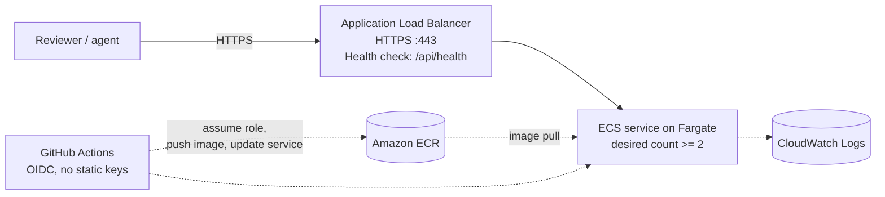

# Deployment

**Outline only.** Infrastructure as code is a separate, later task. Nothing in
this document has been executed, and no AWS resource exists. See
`infra/README.md`.

## 1. Target

| | |
| --- | --- |
| Prototype target | AWS commercial, `us-east-1` (Decision D-1) |
| Intended production target | The agency's platform, presumed to be Azure Government per the interview; AWS GovCloud (US) if AWS were retained (Decision D-11) |
| Compute | Amazon ECS with AWS Fargate, behind an Application Load Balancer (Decision D-2) |
| Image registry | Amazon ECR (Decision D-2) |
| Deployable unit | One container image containing the FastAPI backend and the built frontend assets |

AWS App Runner is excluded because it is not on the AWS FedRAMP services-in-scope
list. See [ADR 0002](adr/0002-compute-ecs-fargate-not-app-runner.md).

## 2. Topology



## 3. Build and release path

1. A pull request merges to `develop`. CI builds the image and generates an SBOM
   but does not push or deploy.
2. A `release/*` branch is cut, stabilized, and merged to `main`.
3. A `vX.Y.Z` tag on `main` triggers the deployment workflow.
4. The workflow assumes an IAM role through GitHub OIDC. **No static AWS access
   keys exist anywhere in this system.**
5. The image is built, tagged with the release tag, and pushed to ECR.
6. The ECS task definition is rendered with the new image and deployed.
7. The workflow waits for service stability. A task failing its health check
   causes ECS to roll back to the previous task definition.

`.github/workflows/deploy.yml` implements this and is committed with `if: false`
on every job, because none of the infrastructure it targets exists. The steps to
enable it are in a comment at the top of that file.

## 4. Configuration at deploy time

Supplied through the ECS task definition as environment variables, never
committed. The full variable list is in
[05_ARCHITECTURE.md](05_ARCHITECTURE.md) section 7.

| Repository variable | Purpose |
| --- | --- |
| `AWS_REGION` | Deployment region |
| `AWS_ROLE_ARN` | IAM role assumed through OIDC |
| `ECR_REPOSITORY` | Image repository name |
| `ECS_CLUSTER`, `ECS_SERVICE`, `ECS_CONTAINER_NAME` | Deployment target |

These are configuration, not secrets. The application's default path requires no
secret to run.

## 5. Health checks and rollback

- `GET /api/health` returns 200 with service name, version, and environment.
- The ALB target group and the container `HEALTHCHECK` both use this endpoint.
- ECS replaces tasks that fail their health check and, with
  `wait-for-service-stability`, a deployment that never stabilizes fails the
  workflow rather than silently leaving a broken service running.
- Rollback is redeploying the previous task definition revision.

## 6. Portability to a FedRAMP-authorized government region

Decision D-11 presumes the agency's platform, Azure per the interview, as the
production target, with AWS GovCloud (US) as the target if AWS were retained.
Portability is carried by the container image and by how the Terraform is
written, not by the region this prototype happens to run in.

The rules the Terraform must follow are listed in `infra/README.md`. In short:
no hardcoded partition, region, or account identifier; ARNs derived from data
sources, because AWS GovCloud (US) uses the `aws-us-gov` partition; and no
dependency on a service absent from the target region. A move to Azure runs the
same image on Azure Container Apps or AKS and requires an Azure provider module
for the Terraform, which this repository does not contain. See
[ADR 0001](adr/0001-cloud-platform-aws.md).

Service availability and FedRAMP in-scope status, in AWS GovCloud (US) or in
Azure Government, are **not asserted here** and must be confirmed against the
FedRAMP Marketplace at deployment time. See
[06_SECURITY_AND_COMPLIANCE.md](06_SECURITY_AND_COMPLIANCE.md) section 4.

## 7. Not decided

Tracked in [OPEN_QUESTIONS.md](OPEN_QUESTIONS.md): custom domain and TLS
certificate source, whether the load balancer is internet-facing or internal,
VPC and subnet topology, Terraform state backend, log retention period, task
CPU and memory sizing, and desired task count.

Task sizing in particular cannot be chosen responsibly before the performance
tier has produced a latency measurement, because OCR is CPU bound and the
5-second target (NFR-1) is the binding constraint.

## 8. Local deployment, which does work

```bash
docker compose up -d --build
curl http://localhost:8000/api/health
```

This is the only deployment path that exists today. See the README quick start.
